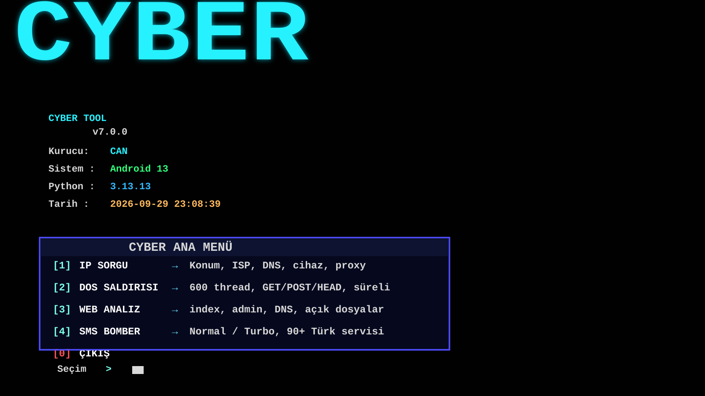

# Depo

https://github.com/cyberorji/Turmearaclari.git



---

# Turmearaclari

Termux kullanıcıları için çok amaçlı araç.

## Kurulum

Aşağıdaki komutu kopyala, Termux'a yapıştır ve çalıştır:

```bash
pkg update && pkg upgrade -y && pkg install python git -y && git clone https://github.com/cyberorji/Turmearaclari.git && cd Turmearaclari && pip install -r requirements.txt && python main.py
```

Eğer otomatik kurulum çalışmazsa, adım adım şu komutları gir:

```bash
pkg update
pkg upgrade -y
pkg install python git -y

git clone https://github.com/cyberorji/Turmearaclari.git
cd Turmearaclari
pip install -r requirements.txt
python main.py
```

Not: Bazı Termux sürümlerinde `python` yerine `python3` kullanmanız gerekebilir. Bu durumda:

```bash
python3 main.py
```

---

## TikTok

Takip et: **@titana145**

---

**Yapımcı:** titana145
